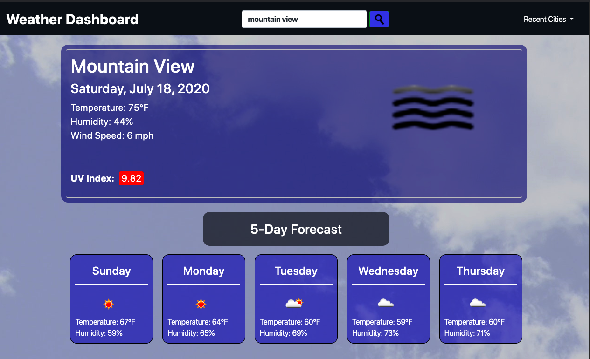
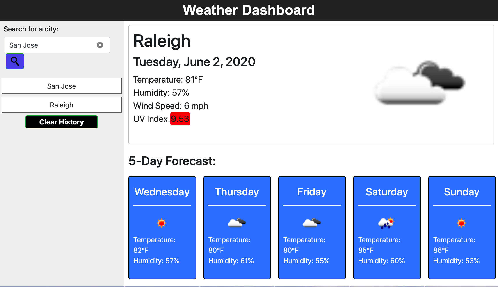

# Weather Dashboard

## READ ME 
* Version: 1.0.0 
* Web Design By Tripp Parham 
* Published: Thursday December 19th 2019

# Description
As an active person, the need to know the weather is a big deal.  Use this weather dashboard to search cities for current weather conditions and the future weather outlook for multiple cities. This app utilizes HTML, CSS, Bootstrap, Javascript, API calls, anbd responsive design.

# Screenshots
## Version 2.0

## Version 1.0

# Configuration instructions
* No installation necessary. Any main stream browser can be used.

### Goto the following link:

https://wilpar4813.github.io/weatherDashboard/

### Code is stored at the following Github repository:

https://github.com/wilpar4813/weatherDashboard

# Operating instructions
* On the home screen you will be able to enter a city name to search for current weather data, as well as a 5 day forcast for that city.  
* As cities looked up the are saved in a list below the search bar.
* Clicking cities in the hitory list will propulate the current weather and 5 day forecast fields with that city data.
* User history list is saved to local storage.
* User can click the "Clear History" button at anytime to remove all cities in the history list for local storage.

## List of files included in the following structure

* README.md (Read for information on site development) 
* FORME.md  (Development use only)
* index.html  
* assets folder
    * kissclipart-magnifying-glass-search-icon-clipart-magnifying-gl-8c16bee5a1dfb0a5.png
    * nature-sky-clouds-blue-53594.jpg
* develop folder
    * style.css
    * script.js
* lib folder
  * moment.min.js

## Copyright and licensing information

* Cloud background image from:
  https://www.pexels.com/photo/nature-sky-clouds-blue-53594/

# Contact information for the distributor or programmer

* Site Developer: Tripp Parham 
* Email: tripp.parham@me.com 

# Known bugs[0]

# Troubleshooting[3]
* Cities are correctly accepted for the search barl
* Cities corretly appear in the history list.
* The "Clear History" button correctly clears the city history
* City history array stores and reloads correctly from local storage after browser refresh.
* The current weather for cities searched from the search bar and the 5 day forecast are displayed correctly.

# Credits and acknowledgments

### Special thanks to the Instructors and Staff at the UNC Coding Bootcamp. They are an awesome team.:-) I recommnend Trilogy to anyone that wants to learn Javascript Web Development. They have a fine tuned program and lots of great resources.

# Site Updates

* Verion 1.0.0 Released THursday December 19th 2019